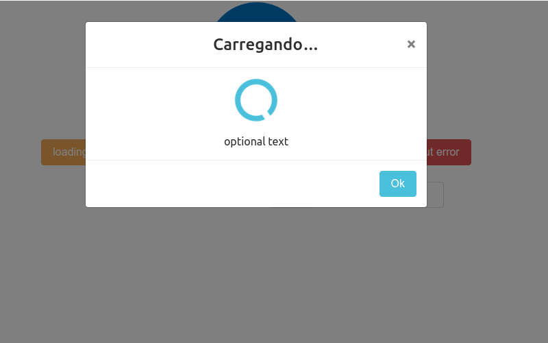

# Vox Preload

[](https://app.codacy.com/app/neliofrazao/voxPreload?utm_source=github.com&utm_medium=referral&utm_content=vox-tecnologia/voxPreload&utm_campaign=badger)

## Loading component for angular 5+ project

[](https://www.codacy.com/app/neliofrazao/voxPreload?utm_source=github.com&amp;utm_medium=referral&amp;utm_content=vox-tecnologia/voxPreload&amp;utm_campaign=Badge_Grade)

*test a live exemple here: https://vox-tecnologia.github.io/voxPreload/*
>### installing:
```
npm i vox-preload --save
```
>### components:
we have three types of loading:
+ A global loading that appears over the application
+ A modal with a loading that pops up when the request is made
+ A local loading that appears under a designated input field

> ### usage:
import the module that you need inside your application's module and the service inside the service with the request that will trigger the loading

```typescript
import {LoadingGlobalModule, LoadingModalModule, LoadingInputModule} from 'vox-preload';
import {LoadingGlobalService, LoadingModalService, LoadingInputService} from 'vox-preload';
```
##### usually "modal" and "global" will be imported inside the main module of the application, but "input" will be imported inside the componet related to it .
***
call the service inside the method that make the request:
+ calls the method "show" to start and "hide" to stop
``` typescript
public makeRequest(){
    loadingGlobalService.show();
    genericService.get(someUrl)
        .then(response => {
        loadingGlobalService.hide();
        })
        .catch( error => {
            loadingGlobalService.hide();
        })
}
```
***
> ### LoadingInputService
+ receives a mandatory string argument and also an optional string as argument on 'show' method, this alter the default loading message.
```Typescript
loadingInputService.show('element-name', 'optional string message')
```
+ also receives two arguments on the 'hide' method, the first one refers to either the succes or error of the request adn it is required, the second is a optional message object.
```typescript
loadingInputService.hide('element-name', 'error', {error: 'optional string message')}
loadingInputService.hide('element-name', 'success', {success: 'optional string message')}
```
```html
<!-- this tag should be right under the input element -->
<vox-loading-input name="element-name"></vox-loading-input>
```
> ### LoadingLocalService
+ receives a mandatory string as argument on 'show' method to indicate witch 'loading' you wish to sow, this allows you to put many 'loading' elements on the same html.
```Typescript
loadingLocalService.show('element name')
```
+ also receives a 'name' argument on the 'hide' method.
```typescript
loadingLocalService.hide('element name')
```
```html
<!-- this tag should be right under the async element  -->
<vox-loading-local name="element-name"></vox-loading-local>
```

> ### LoadingModalService
+ receives an optional content object as argument on 'show' method, this alter the default loading message.
```Typescript
loadingModalService.show({title: 'optional string title', message: 'optional string message'});
loadingModalService.hide()
```
```html
<!-- this tag should be in the main htmll of your app (usually app.component.html) -->
<vox-loading-modal></vox-loading-modal>
```
#### *LoadingGlobalService doesn't receive any argument*
```Typescript
loadingModalService.show();
loadingModalService.hide()
```
```html
<!-- this tag should be in the main html of your app (usually app.component.html) -->
<vox-loading-global></vox-loading-global>
```

 Global loading exemple

 Modal loading exemple

 Input loading exemple

 Input response exemple
